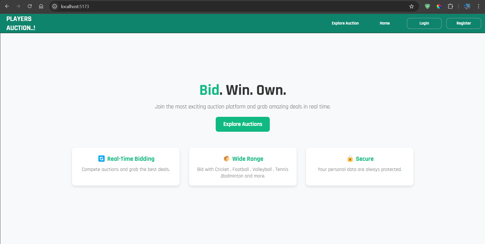
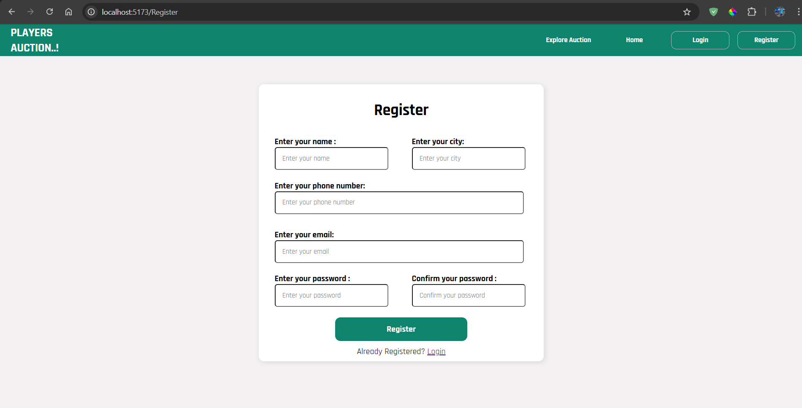
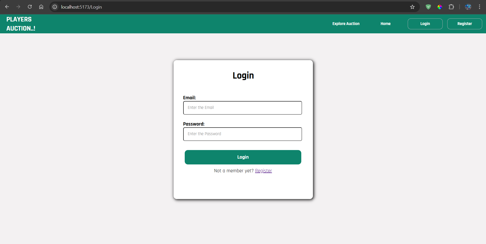
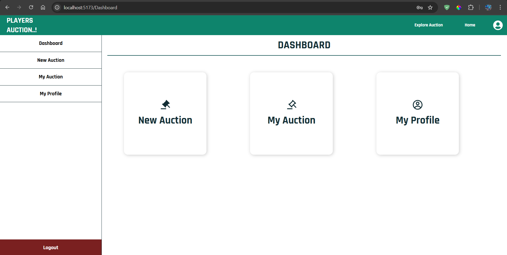

## Auction System
An online auction system where users can bid on players in real-time.

# Tech Stack

**Frontend       :**    React, Vite, HTML, CSS, JS
**Backend        :**    Node.js, Express, GraphQL
**Database       :**    PostgreSQL

# Features
✔️ User Registration & Login  
✔️ Create and Manage Auctions  
✔️ Real-time Bidding System  
✔️ Secure Payments  

# 🛠 Installation
Clone the Repository
git clone https://github.com/tring-jayaprakash/auctionProject.git
cd auction-system

Backend Setup
cd server
npm install
npm start

Frontend Setup
cd client
npm install
npm run dev

# Folder Structure
📦 auction-system
 ┣ 📂 client  (React frontend)
 ┣ 📂 server  (Node.js backend)
 ┣ 📜 README.md  Documentation

# API Documentation
Retrieve a list of available auctions.

query{
  getAuction{
    auction_id
    logo
    sports
    auction_name
    date
    time
    base_bit
    bit_increse_by
    min_player
    max_player
    auction_status
  }
}

Response Example:

{
  "data": {
    "getAuction": [
      {
        "auction_id": "44",
        "logo": "",
        "sports": "Cricket",
        "auction_name": "IPL3",
        "date": "1741890600000",
        "time": "20:56:00",
        "base_bit": 4454,
        "bit_increse_by": 45545,
        "min_player": 4555,
        "max_player": 5455,
        "auction_status": "pending"
      },
      {
        "auction_id": "80",
        "logo": "",
        "sports": "Cricket",
        "auction_name": "IPL",
        "date": "1741890600000",
        "time": "22:37:00",
        "base_bit": 1000,
        "bit_increse_by": 100,
        "min_player": 1,
        "max_player": 1,
        "auction_status": "completed"
      }
    ]
  }
}

# Contributing to the Project
Fork the Repositor
Click the "Fork" button at the top-right corner of this repository to create your own copy.

Clone the Repository
Run the following command to clone the repo to your local machine:

git clone https://github.com/tring-jayaprakash/auctionProject.git
cd auction-system

Create a New Branch
Make sure you're on the main branch and create a new branch for your feature or fix:

git checkout main
git pull origin main
git checkout -b feature-name

Make Changes & Commit
Edit the code, add new features, or fix bugs. Then, commit your changes:

git add .
git commit -m "Added new feature: feature-name"

Push Changes to GitHub
git push origin feature-name

# License
This project is licensed under the MIT License.

Copyright (c) 2025 Jayaprakash S

Permission is hereby granted, free of charge, to any person obtaining a copy  
of this software and associated documentation files (the "Software"), to deal  
in the Software without restriction, including without limitation the rights  
to use, copy, modify, merge, publish, distribute, sublicense, and/or sell  
copies of the Software.

# Demo

landing page

register

login

dashbord
